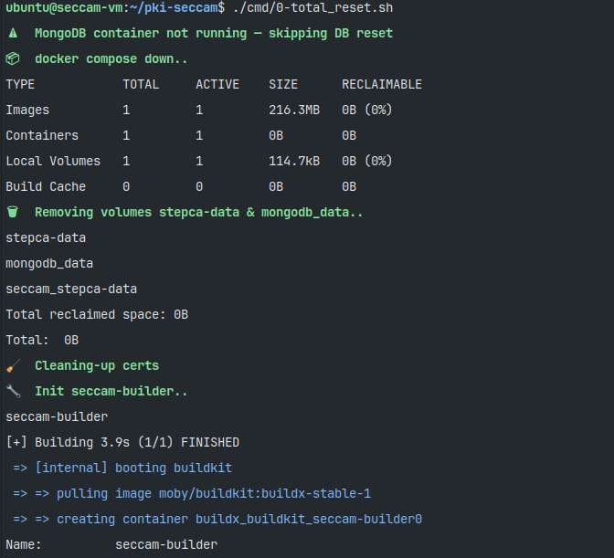
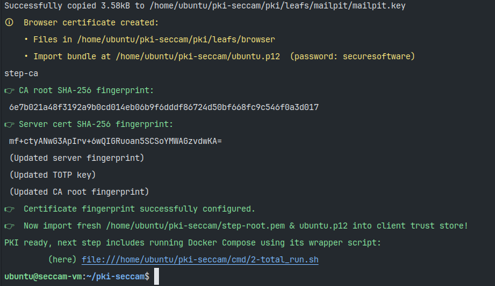
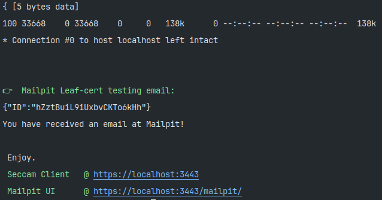

## Table of Contents
- [**i.** Introduction](#i-introduction)
- [**ii.** System Prerequisites](#ii-system-prerequisites)
- **[I. SECCAM: Build & Run](#i-seccam-build--run)**
    - [**I.0** Flush Script ](#i0-flush-script-cmd0-total_resetsh)
    - [**I.1** PKI Setup Script](#i1-pki-setup-script-cmd1-pki_setupsh)
    - [**I.2** Docker Run Script](#i2-docker-run-script-cmd2-total_runsh)
- [**a.** Dependencies](#a-dependencies)
- [**b.** Troubleshooting](#b-troubleshooting)

---

## i. Introduction

Computer Project for the course `INFO-Y115 - Secure Software Design & Web Security` at Free University of Brussels.


<table style="width:100%; border-collapse: collapse;">
  <tr>
    <th style="border: 1px solid black;">Role</th>
    <th style="border: 1px solid black;">Name</th>
    <th style="border: 1px solid black;">Matricule</th>
  </tr>
  <tr>
    <td style="border: 1px solid black;"><b>Student</b></td>
    <td style="border: 1px solid black;"><b>BOTTON</b> David</td>
    <td style="border: 1px solid black;">000615056</td>
  </tr>
  <tr>
    <td style="border: 1px solid black;"><b>Professor</b></td>
    <td style="border: 1px solid black;"><b>Pr. Absil</b> R.</td>
    <td style="border: 1px solid black; background-color: #24292e;"></td>
  </tr>
</table>

*For the complete Developer Documentation and Project Report, please refer to that [`Document`](doc/info-y115_report_seccam_botton.pdf).*


## ii. System Prerequisites

This repository is functional under any LTS or rolling-release Linux distribution. Final tests were conducted on Ubuntu 22LTS in a VirtualBox VM.

```bash
node --version   #SHOULD return v22
docker --version
docker compose version
docker buildx version
docker run hello-world
```
**If, when running the code block above:**
- terminal says *command not found* 
- terminal asks for *sudo privileges*

**Then:** jump to *[dependencies](#a-dependencies)*.

---

## I. SECCAM: *Build & Run*  
**⚠️All commands to be run from the root directory of the project** (but troubleshooting) ⚠️
- follow build scripts in numerical order and make sure to run each one once.

---

### I.0 Flush Script [`cmd/0-total_reset.sh`](cmd/0-total_reset.sh)

This is a destructive maintenance script, it will reset PKI entirely and bootstrap the whole Docker building stack.
:
- it **removes** the existing database, stops and removes all containers of the stack,
  removes the *Docker PKI and Database Volumes*, removes all dangling images, caches and
  BuildKit data, *etc..*
- it **output** Docker’s disk usage
  report, prints reclaimed image IDs and recovered space, and finally prints the Buildx inspection
  summary
```bash
./cmd/0-total_reset.sh
```



### I.1 PKI Setup Script [`cmd/1-pki_setup.sh`](cmd/1-pki_setup.sh)

**Always precede that script with the Total Reset Script seen above.** 

The PKI Setup Script bootstraps a new, isolated public-key infrastructure; it generates and injects new secure passwords into a fresh step-ca PKI container and makes sure to manage some `./.env` entries automatically **(Avoid messing with these rows)**.


For the PKI; Smallstep CA is used with ACME enabled but only listening on localhost,
a JWK provisioner is setup, it creates one-year X.509 leaf certificates for backend, frontend, browser and mailpit services, each with strict SAN lists and matching private keys, it concatenates full chains using the intermediate, and copies all artefacts
along with the root certificate to host-side. It then removes the CA container so secrets
are still in the volume and reminds the operator to place step-root.pem in all client trust stores.

```bash
./cmd/1-pki_setup.sh
```

> ⚠️ **Warning – Academic Purposes Only**
> - Running this script will copy the entire PKI into the repo's `./pki` folder, these are obviously also mounted directly in Docker Volumes.
> - It will generate client trust-store importable `step-root.pem` Root CA certificate and a signed browser `.p12` crypto payload in the project’s root directory.
> 
> `step-root.pem` is to be imported, but the browser `.p12` payload is currently optional; *mTLS* is not enforced globally at the time of project's due date. 
> 
> In [`nginx/nginx.conf`](nginx/nginx.conf), if you were to uncomment the last few lines and set client verification to **on**  it would be impossible to access the application without that `.p12` also imported. The reason for that are development impediments encountered when trying diverse Javascript libraries to generate fully valid `.p12`.





### I.2 Docker Run Script [`cmd/2-total_run.sh`](cmd/2-total_run.sh)

**Run this script how often you need, as long as PKI setup has not been reset in-between.**

Boots the stack using hard-TLS authentication: it re-builds all images with a specific Buildx, boots the empty containers after removing any orphaned services, and sets them up with secrets defined in `./.env`. After the stack is booted, it verifies the security chain end-to-end: it prints out the root CA subject/issuer, verifies the server full-chain under step-ca, performs a live HTTPS handshake against backend, through a restrictive reverse proxy, using the root CA to prove certificate sanity and cipher strength (TLS1.3, AES-256-GCM, ECDSA 1P-256), and exercises Mailpit’s REST endpoint over HTTPS as well as its SMTP STARTTLS enforcement. All the checks occur locally, with curl fixed to step-root.pem, so any downgrade or MITM makes the script abort.

```bash
./cmd/2-total_run.sh
```


⚠ If these green lines do not appear, [`cmd/2-total_run.sh`](cmd/2-total_run.sh) has failed, jump to ️[troubleshooting](#b-troubleshooting).
\
✔ Otherwise, visit `https://{vm_private_ip_or_localhost}:3443/` in your local, favorite browser!

*``Note: `` Access the API documentation endpoint at  /api-docs*
## a. Dependencies
For the *apt package manager* under *systemd*, run the following commands:
```bash
sudo apt update
sudo apt install -y ca-certificates curl gnupg lsb-release nodejs
sudo install -m0755 -d /etc/apt/keyrings
curl -fsSL https://download.docker.com/linux/ubuntu/gpg \
  | sudo gpg --dearmor -o /etc/apt/keyrings/docker.gpg
sudo chmod a+r /etc/apt/keyrings/docker.gpg
echo "deb [arch=$(dpkg --print-architecture) \
  signed-by=/etc/apt/keyrings/docker.gpg] \
  https://download.docker.com/linux/ubuntu \
  $(lsb_release -cs) stable" \
  | sudo tee /etc/apt/sources.list.d/docker.list > /dev/null
sudo apt update
```
```bash
sudo apt install -y docker-ce docker-ce-cli containerd.io docker-buildx-plugin docker-compose-plugin
```
```bash
sudo systemctl enable --now docker
sudo systemctl status docker
```
Replace ubuntu with your own username below
```bash
sudo usermod -aG docker ubuntu
su - ubuntu
```

---

## b. Troubleshooting
> ### IF: using a rolling-release Linux distribution script [`cmd/2-total_run.sh`](cmd/2-total_run.sh) fails
You need to revert to an earlier version of Node.js using NVM.
```bash
mkdir ~/.nvm
curl -o- https://raw.githubusercontent.com/nvm-sh/nvm/v0.39.7/install.sh | bash

export NVM_DIR="$HOME/.nvm"
[ -s "$NVM_DIR/nvm.sh" ] && \. "$NVM_DIR/nvm.sh"

nvm install 22.17.1
nvm use 22.17.1
```
Then rebuild the problematic nodes
```bash
npm install --verbose --omit=dev 
```

---

> ### IF: empty directories appear in `./pki` filesystem instead of crypto-related files when running [`cmd/1-pki_setup.sh`](cmd/1-pki_setup.sh)
The cause of that issue was not identified, but deleting these artifacts and resetting the project will do the trick.

---

> ### IF: unhealthy container(s) error when running [`cmd/2-total_run.sh`](cmd/2-total_run.sh)
Could be a node/npm issue, best course of action is to purge/reinstall them and rebuild the failing container.
```bash
sudo apt remove --purge nodejs libnode-dev libnode72 -y
sudo apt autoremove -y
sudo apt clean
```
Reinstall latest versions.
```bash
curl -fsSL https://deb.nodesource.com/setup_22.x | sudo -E bash -
sudo apt install -y nodejs
```
Then, inside the *problematic container's* directory, delete `node_modules` folder as well as `package-lock.json`, make $PWD point and rebuild:
```bash
npm install --verbose --omit=dev #this could take "a while"..
```

---